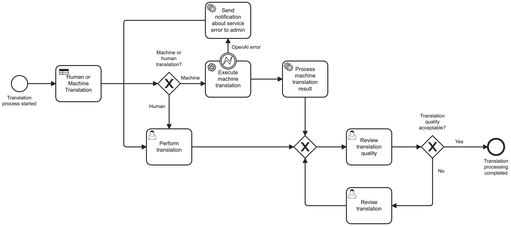

# Business Process Management with BPMN 2.0 and Camunda

This repository contains solutions developed for the "Creation of Business Applications (B0B36TPA)" course at Czech Technical University (CTU) in Prague. The main focus of this project was to learn and implement BPMN 2.0 annotations using Camunda.

## Translation Process Implementation

The final process implementation can be found in the `translation-process` folder.

- **User Requirements Submission**: Allows users to submit translation requirements through a form
- **Pricing System**: Automatically calculates translation costs based on requirements
- **Payment Processing**: Handles payment workflow with a 14-day timeout
- **Translation Execution**: Supports both machine (OpenAI) and human translation paths
- **Quality Assurance**: Includes review and revision cycles for translation quality
- **Delivery System**: Automated delivery of completed translations

Below is the visual representation of the implemented business process:

Execute Translation Subprocess:

